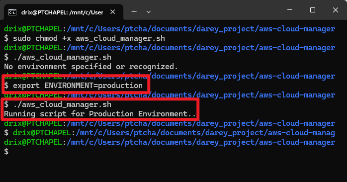
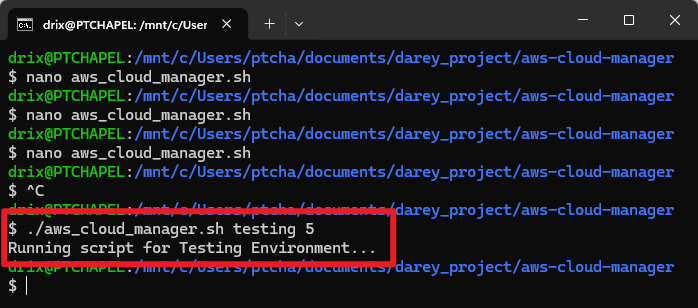
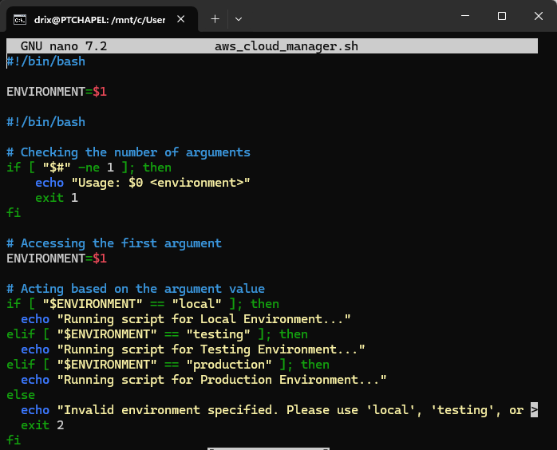
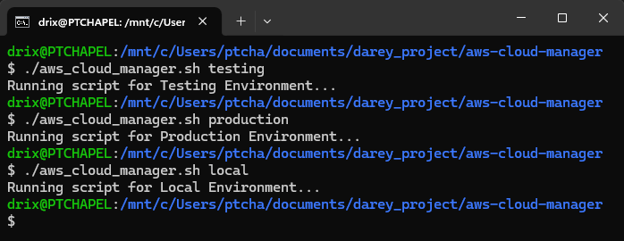

Here is the cleaned-up and well-structured version of your Markdown documentation:

---

# AWS Cloud Manager Script – Learning Documentation

## 📌 Project Overview

This mini project demonstrates the differences between **Infrastructure Environments** and **Environment Variables**, and how to use them effectively in a shell script.

## 🎯 Learning Objectives

* Understand the distinction between Infrastructure Environments and Environment Variables
* Use environment variables to control script behavior dynamically
* Accept user input through positional parameters
* Apply input validation in shell scripting

---

## 🧠 Concepts Learned

### Infrastructure Environments vs Environment Variables

**Infrastructure Environments** are distinct stages where applications are developed and deployed:

* **Development Environment**: Local (VirtualBox + Ubuntu)
* **Testing Environment**: AWS Account 1
* **Production Environment**: AWS Account 2

**Environment Variables** are key-value pairs that dynamically configure behavior across these environments.

#### 💡 Real-World Example – FinTech Database Connectivity

```bash
# Development
DB_URL=localhost
DB_USER=test_user
DB_PASSWORD=test_pass

# Testing
DB_URL=test-db.aws.com
DB_USER=test_user
DB_PASSWORD=test_pass

# Production
DB_URL=prod-db.aws.com
DB_USER=prod_user
DB_PASSWORD=prod_pass
```

---

## 🛠️ Script Development Process

### ✅ Step 1: Basic Environment Variable Implementation

Create `aws_cloud_manager.sh`:

```bash
#!/bin/bash

# Check the ENVIRONMENT variable
if [ "$ENVIRONMENT" == "local" ]; then
  echo "Running script for Local Environment..."
elif [ "$ENVIRONMENT" == "testing" ]; then
  echo "Running script for Testing Environment..."
elif [ "$ENVIRONMENT" == "production" ]; then
  echo "Running script for Production Environment..."
else
  echo "No environment specified or recognized."
  exit 2
fi
```

**Make it executable:**

```bash
sudo chmod +x aws_cloud_manager.sh
```

**Testing Output:**

```bash
# Without variable
./aws_cloud_manager.sh
# ➜ No environment specified or recognized.

# With variable
export ENVIRONMENT=production
./aws_cloud_manager.sh
# ➜ Running script for Production Environment
```



---

### ✅ Step 2: Implementing Positional Parameters

Update the script to accept arguments:

```bash
#!/bin/bash

ENVIRONMENT=$1

if [ "$ENVIRONMENT" == "local" ]; then
  echo "Running script for Local Environment..."
elif [ "$ENVIRONMENT" == "testing" ]; then
  echo "Running script for Testing Environment..."
elif [ "$ENVIRONMENT" == "production" ]; then
  echo "Running script for Production Environment..."
else
  echo "No environment specified or recognized."
  exit 2
fi
```

**Key Insight:** Positional parameters (`$1`, `$2`, etc.) allow passing values at runtime.



---

### ✅ Step 3: Adding Input Validation

Input validation ensures safe usage:

```bash
#!/bin/bash

# Validate number of arguments
if [ "$#" -ne 1 ]; then
  echo "Usage: $0 <environment>"
  exit 1
fi

ENVIRONMENT=$1

if [ "$ENVIRONMENT" == "local" ]; then
  echo "Running script for Local Environment..."
elif [ "$ENVIRONMENT" == "testing" ]; then
  echo "Running script for Testing Environment..."
elif [ "$ENVIRONMENT" == "production" ]; then
  echo "Running script for Production Environment..."
else
  echo "Invalid environment specified. Please use 'local', 'testing', or 'production'."
  exit 2
fi
```



---

## 🧪 Script Testing Results

### ✅ Valid Commands:

```bash
./aws_cloud_manager.sh local
./aws_cloud_manager.sh testing
./aws_cloud_manager.sh production
# ➜ Running script for Local/Testing/Production Environment
```



---

## 📝 Key Takeaways

### Best Practices Learned

1. **Avoid Hard-coding** – Use variables and parameters
2. **Validate Input** – Prevent misuse and unexpected behavior
3. **Clear Errors** – Provide helpful usage instructions
4. **Proper Exit Codes** – `0` = success, `1` = usage error, `2` = invalid input

### Positional Parameters Summary

| Parameter | Meaning             |
| --------- | ------------------- |
| `$0`      | Script name         |
| `$1`      | First argument      |
| `$#`      | Number of arguments |
| `$@`      | All arguments       |

---

## 🧾 Summary

This project clarified how **Infrastructure Environments** define where code runs, while **Environment Variables** define how code behaves. Through progressive improvements—starting with environment checks and ending with full input validation—I built a dynamic, reusable script applicable across real-world scenarios. This forms a solid foundation for writing robust automation scripts in DevOps workflows.

---